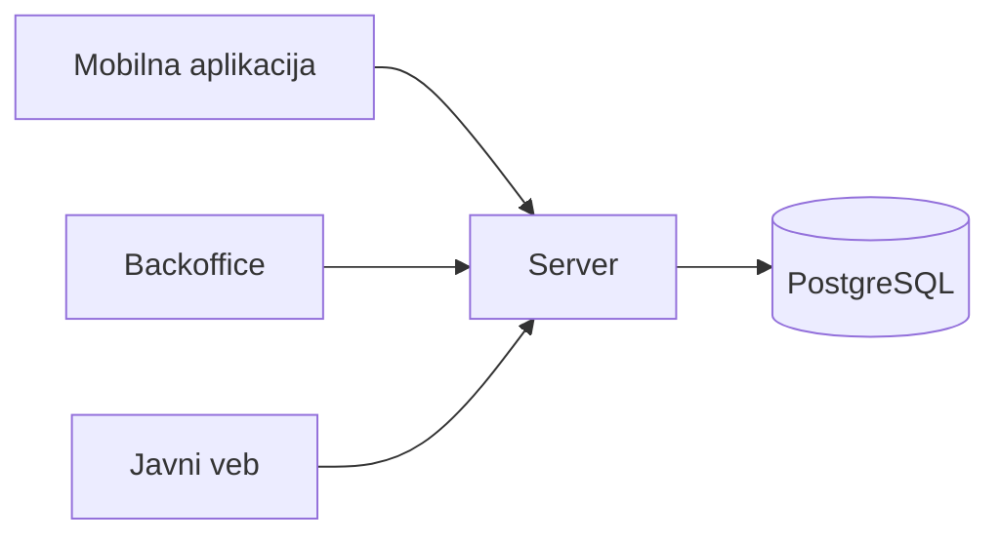

# Rafstoran

Sistem za rezervacije u restoranu. Gosti rezervišu sto preko mobilne aplikacije, a osoblje vodi rezervacije i raspored stolova iz backoffice aplikacije. Meni, radno vreme i slobodni termini javno su dostupni na vebu.

Primer sa vežbi iz predmeta Razvoj multiplatformskih aplikacija.

## Tim

| Ime i prezime | Broj indeksa | GitHub nalog |
| --- | --- | --- |
| Luka Petrović | — | [@github-nalog](https://github.com/github-nalog) |
| Nikola Paunović | — | [@github-nalog](https://github.com/github-nalog) |

U projektima studenata tabela sadrži oba člana tima, sa brojem indeksa.

## Zahtevi za temu

1. **Uloge.** Sistem koriste gosti i osoblje restorana, konobari i menadžer, sa različitim ovlašćenjima: gost upravlja samo svojim rezervacijama, a osoblje vidi sve.
2. **Stanja.** Rezervacija prolazi kroz više stanja: čeka potvrdu, potvrđena je, a zatim gost stiže, ne dolazi ili je rezervacija otkazana.
3. **Pravila.** Rezervacija je za najviše 12 osoba i otkazuje se najkasnije 2 sata pre termina. Isti sto ne može biti dvaput rezervisan u isto vreme; to zavisi od rezervacija drugih gostiju, pa konačno odlučuje server.
4. **Rad bez mreže.** Gost vidi svoje rezervacije i može da ih otkaže i bez signala; otkazivanje se šalje kada se veza vrati.
5. **Posao za osoblje.** Osoblje svakog dana radi sa rasporedom svih stolova i rezervacija, što je posao za veći ekran.
6. **Javni sadržaj.** Meni, radno vreme i slobodni termini zanimaju i one koji još nisu gosti, pa ima smisla da ih pronađu pretraživači.

## Delovi sistema

| Deo | Korisnici | Tehnologija | Platforme |
| --- | --- | --- | --- |
| Mobilna aplikacija | gosti | Flutter | Android |
| Backoffice | konobari, menadžeri | Flutter | Windows, veb |
| Javni veb | svi posetioci | Jaspr | pregledač |
| Server | ostali delovi sistema | Relic, PostgreSQL | Linux |
| Domenski paket | svi delovi sistema | Dart | sve |

Svi delovi koriste isti domenski paket, u kome su model i pravila. Server čuva podatke i ponovo proverava svako pravilo.

## Stanje projekta

Opis sistema. Detaljan opis domena i kod dodaju se tokom semestra.
